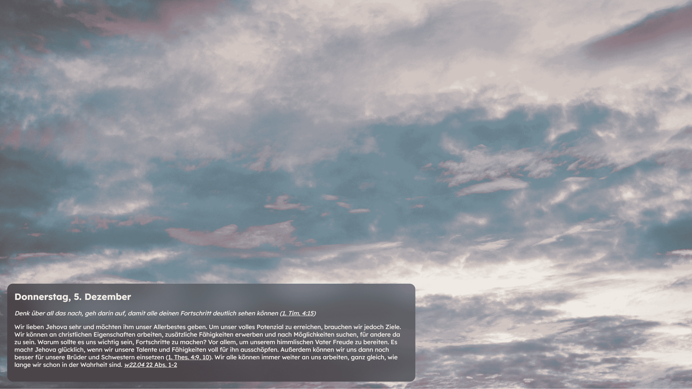

# DailyTab 📚

**DailyTab** is a Chrome extension that replaces your new tab page with a personalized experience. It displays the daily text from [jw.org](https://wol.jw.org) alongside a stunning background image fetched from Pexels, providing both inspiration and beauty every time you open a new tab.

----------

## Features

-   **Daily Text**: Automatically fetches and displays the daily text from [jw.org](https://wol.jw.org).
-   **Dynamic Backgrounds**: Beautiful random backgrounds from curated collections on Pexels.
-   **Minimalist Design**: Clean and simple interface for distraction-free inspiration.

----------

## Installation

1.  **Clone or Download the Repository**:  
    Click on the green "Code" button on this GitHub repository and select **Download ZIP** or clone it using:
    
    bash
    
    Copy code
    
    `git clone https://github.com/sauer-adrian/DailyTab.git` 
    
2.  **Enable Developer Mode** in Chrome:
    
    -   Open Chrome and go to `chrome://extensions/`.
    -   Toggle the "Developer mode" switch in the top-right corner.
3.  **Load the Extension**:
    
    -   Click **Load unpacked** and select the folder where you extracted or cloned this repository.
4.  **Enjoy!**  
    Open a new tab, and you’ll see the DailyTab interface.
    

----------

## Technologies Used

### **Frontend**

-   **HTML/CSS/JavaScript**: Core technologies for rendering and interactivity.
-   **Bootstrap**: For responsive and modern UI components.
-   **Google Fonts**: Fonts for a polished and professional appearance.

### **APIs**

-   **JW.org**: For fetching the daily text content.
-   **Pexels API**: To retrieve stunning background images.

### **Chrome Extension**

-   **Manifest v3**: Chrome’s extension framework to define permissions, background scripts, and overrides.
-   **Service Workers**: For handling background tasks and fetching data efficiently.

----------

## Screenshot

----------

## Known Issues

-   Requires an active internet connection to fetch the daily text and background images.
-   If fetching fails, a fallback message is displayed.
-   Clicked links redirect to https://wol.jw.org/ and show data there instead of opening a popup.

----------

Feel free to contribute or suggest improvements. 🌟
